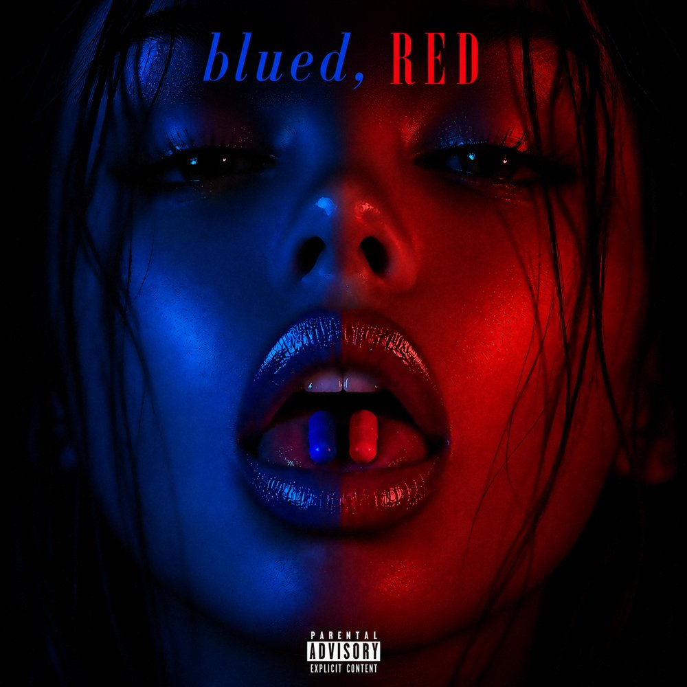

  

<h1 align="center">BAMBA — <i>blued,</i> RED</h1>

  10 tracks · Swahili / English · Free download 
  <b>Parental Advisory: Explicit Content</b>

---

## The artist

**BAMBA is the architect of Uswazi Noir.**

The Dar es Salaam native is operating outside the commercial machinery of East African pop. He is bridging the late night aesthetics of global alternative R&B with the raw realities of modern Tanzanian youth culture.

## The album

His debut independent project, ***blued, RED***, is a cinematic audio-documentary of modern isolation. It's a substance fueled escapism, that adds to the devastating friction of *Usaliti* (betrayal). BAMBA anchors Western "sad-boy" sonics into the local concrete of Kigogo by moving between English and Swahili slang. The tape samples iconic cultural relics from the dramatic weight of Steven Kanumba, to the sobering humor of Mzee Majuto & Sharo Milionea, plus Bambo. It strips away the glamorous illusions of the fast life to reveal the unfiltered truths of Uswaziland.

No label middlemen. Just a direct line from the trenches to your speakers. Nomad.

---

## Tracklist

### *blued,* — Side A (Swahili)

| # | Title | Notes | Written by |
|---|-------|-------|------------|
| 01 | back from america | Skit · narrated by Sharo Milionea & Mzee Majuto | Hussein Mkiety; Amri Athuman |
| 02 | malaika | | Adam Salim; Fadhili William; Tom Mboya; Miriam Makeba; Andrew Bambaga |
| 03 | self control | | Christopher Breaux; Malay Ho; Jon Brion; Alex G; Austin Feinstein; Andrew Bambaga |
| 04 | dalilah | | Axon; Joshua Baraka; ZIKKU; Andrew Bambaga |
| 05 | ukimuona | Acapella | Andrew Bambaga; Nasibu Abdul |
| 06 | usaliti | Skit · by Kanumba | Steven Kanumba |

### RED — Side B (English)

| # | Title | Notes | Written by |
|---|-------|-------|------------|
| 07 | FEELS | | Brooderick; Andrew Bambaga |
| 08 | MISS U | | Andrew Bambaga; ZIKKU; Kelvin Harrison Jr.; Alexa Demie |
| 09 | IMPERFECTLY PERFECT | | Andrew Bambaga; ZIKKU |
| 10 | 4AM IN KIGOGO | Featuring Bambo | Brooderick; Andrew Bambaga; Dickson Makwaya |

## Themes

- American accent stigma
- Singing vs rapping
- Melancholia
- The Kigogo floods, as residents lived them, narrated by Bambo
- Swahili vs English
- Acceptance

---

## Listen

The full album is free to download from the official site. Its embedded with the lyrics to every track.

This is a free release. It is not for sale. Samples and interpolations are credited to their original writers above.

## About this repository

This repository holds the album's website. Its hosted on Netlify.

| File | What it is |
|------|------------|
| `index.html` | The album page |
| `lyrics.js` | Lyrics for all 10 tracks and the lyrics viewer |
| `cover.jpg` | Official cover |
| `cover-alt.jpg` | Alternate hand-drawn cover |

---

Nomads ©

